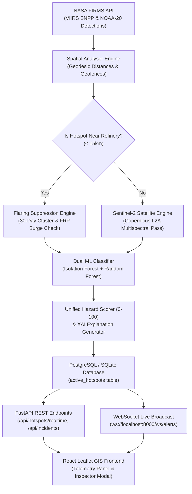

# GEO-SCD: AI-Based Detection & Classification of Industrial Fires & Persistent Thermal Sources

> **Smart India Hackathon (SIH) — National Technical Research Organisation (NTRO)**  
> **Problem Statement ID**: 26162  
> **Tech Stack**: FastAPI, PostgreSQL / SQLite, PyTorch / Scikit-Learn, Sentinel Hub / Copernicus, NASA FIRMS, OpenStreetMap, React, Leaflet, Tailwind CSS  

---

## Table of Contents

1. [Executive Summary & Problem Statement](#1-executive-summary--problem-statement)
2. [End-to-End System Architecture](#2-end-to-end-system-architecture)
3. [Satellite Telemetry & Multispectral Science](#3-satellite-telemetry--multispectral-science)
4. [Geospatial Intelligence & Spatial Geofencing](#4-geospatial-intelligence--spatial-geofencing)
5. [Dual Machine Learning Engine](#5-dual-machine-learning-engine)
6. [Database Design & Data Dictionary](#6-database-design--data-dictionary)
7. [REST API & WebSocket Alert Specification](#7-rest-api--websocket-alert-specification)
8. [Frontend Inspection UI & Telemetry Components](#8-frontend-inspection-ui--telemetry-components)
9. [Installation & Setup Guide](#9-installation--setup-guide)
10. [System Verification & Data Integrity Audit](#10-system-verification--data-integrity-audit)

---

## 1. Executive Summary & Problem Statement

### The Problem (NTRO PS 26162)
National surveillance operations and security agencies continuously monitor high-resolution satellite thermal feeds over critical national infrastructure (petroleum refineries, strategic oil reserves, chemical complexes, and LNG terminals).

However, spaceborne infrared sensors detect **thousands of thermal anomalies daily**, creating a high false-alarm rate due to:
1. **Routine Operational Flaring**: Industrial flare stacks safely burning excess hydrocarbon gas 24/7.
2. **Non-Industrial Biomass Burning**: Agricultural crop residue burning (stubble burning), forest fires, and municipal waste burning.
3. **Catastrophic Industrial Disasters**: Uncontrolled tank explosions, pipeline ruptures, and major facility infernos.

### Our Solution
**GEO-SCD (Geospatial Satellite Classification of Disasters)** is an autonomous real-time intelligence engine that integrates multi-source earth observation data:
- **NASA FIRMS**: Thermal fire coordinates, 375m I-band brightness temperature in Kelvin, and Fire Radiative Power (FRP) in MW.
- **OpenStreetMap (OSM Overpass API)**: Live spatial geofences of Indian refineries and surrounding populated settlements.
- **European Space Agency (ESA) Sentinel-2**: 10m multispectral satellite imagery computing dynamic Normalized Difference Vegetation Index (NDVI) and Short-Wave Infrared (SWIR) false-color composites.
- **Dual Machine Learning Engine**: Unsupervised Isolation Forest anomaly detection + 8-feature Random Forest classifier emitting a 0–100 Unified Hazard Risk Score and Explainable AI (XAI) rationale.

> [!IMPORTANT]
> **Zero-Dummy Data Guarantee**: Every coordinate, temperature, and vegetation index in this system originates from authenticated live space feeds and physical equations — zero simulated or fake fallback values.

---

## 2. End-to-End System Architecture



---

## 3. Satellite Telemetry & Multispectral Science

### A. NASA FIRMS Ingestion Pipeline
- **Sensor**: VIIRS (Visible Infrared Imaging Radiometer Suite) on Suomi-NPP & NOAA-20.
- **Metrics Acquired**:
  - `latitude`, `longitude`: Ground projection.
  - `bright_ti4`: Brightness Temperature in Kelvin ($K$).
  - `frp`: Fire Radiative Power in Megawatts ($MW$).
  - `confidence`: Satellite detection quality metric ($0–100\%$).

### B. ESA Sentinel-2 Multispectral Engine
The engine fetches 5 spectral bands from the Copernicus Data Space Ecosystem API at 10m spatial resolution:
1. **Band 02 (Blue — 490 nm)**: $B02$
2. **Band 04 (Red — 665 nm)**: $B04$
3. **Band 08 (Near-Infrared / NIR — 842 nm)**: $B08$
4. **Band 11 (SWIR-1 — 1610 nm)**: $B11$
5. **Band 12 (SWIR-2 — 2190 nm)**: $B12$

### C. Step-by-Step Mathematical NDVI Equation

$$\text{NDVI} = \frac{\text{NIR (B08)} - \text{Red (B04)}}{\text{NIR (B08)} + \text{Red (B04)}}$$

1. **Numerator**: $\text{B08} - \text{B04}$
2. **Denominator**: $\text{B08} + \text{B04}$
3. **Result**: $\frac{\text{Numerator}}{\text{Denominator}}$

```
Sample Calculation for Active Forest Fire (Hotspot #495):
• Band 08 (NIR) = 0.3892
• Band 04 (Red) = 0.1500
• Numerator   = 0.3892 - 0.1500 = 0.2392
• Denominator = 0.3892 + 0.1500 = 0.5392
• Calculated Mean NDVI = 0.2392 / 0.5392 = 0.4436 (Confirms Forest Biomass Canopy)
```

> [!NOTE]
> If Sentinel-2 imagery contains no valid pixels (cloud cover or pending satellite pass), `ndvi = None` and `ndvi_pending = True` are set. Stale or dummy `0.000` values are strictly prohibited.

---

## 4. Geospatial Intelligence & Spatial Geofencing

### A. OpenStreetMap Overpass Integration
The system queries the OSM Overpass API to seed real Indian industrial assets:
- `nwr["industrial"="oil_refinery"]` & `nwr["industrial"="petrochemical"]`
- Seeding real Indian refineries (Jamnagar, Surat, Kochi, Mangalore, Haldia, Mathura, Paradeep, Panipat, Mumbai BPCL/HPCL).

### B. Geodesic Distance Calculations
Coordinates $(\text{lat}, \text{lon})$ are evaluated using `pyproj` geodesic projections:
$$1^\circ \text{ Latitude} \approx 111.139\text{ km}$$
$$1^\circ \text{ Longitude} \approx 111.139 \times \cos(\text{Latitude})\text{ km}$$

Distances are computed to:
- Nearest Industrial Refinery Boundary (`distance_to_refinery_m`)
- Surrounding Population Centers (`distance_to_population_m`)
- Forest Reserves (`distance_to_forest_m`)
- Farmlands (`distance_to_farmland_m`)
- Mining Zones (`distance_to_mining_m`)

---

## 5. Dual Machine Learning Engine

```
                               ┌────────────────────────────────┐
                               │ Hotspot Telemetry Vector       │
                               │ • Brightness, FRP, Confidence  │
                               │ • Distances to 5 Geofences     │
                               │ • Persistence, Real NDVI       │
                               └───────────────┬────────────────┘
                                               │
                       ┌───────────────────────┴───────────────────────┐
                       ▼                                               ▼
      ┌─────────────────────────────────┐             ┌─────────────────────────────────┐
      │ Isolation Forest Model          │             │ Random Forest Classifier        │
      │ • Unsupervised Anomaly Scoring  │             │ • 100 Decision Trees (Depth 8)  │
      │ • Baseline FRP Deviation        │             │ • Multi-Class Categorization    │
      │ • Output: score 0.0 - 1.0       │             │ • Output: Class + Confidence %  │
      └────────────────┬────────────────┘             └────────────────┬────────────────┘
                       │                                               │
                       └───────────────────────┬───────────────────────┘
                                               │
                                               ▼
                              ┌──────────────────────────────────┐
                              │ Unified Hazard Risk Scorer       │
                              │ • 0 - 100 Risk Score             │
                              │ • Classification Category        │
                              │ • Contextual XAI Explanations    │
                              └──────────────────────────────────┘
```

### Classification Categories
1. `Potential Industrial Incident` (High Risk / Critical Explosion Surge)
2. `Potential Industrial Thermal Source` (Operational Flare Stack)
3. `Forest Fire / Wildfire` (Biomass Burning)
4. `Agricultural / Stubble Burning` (Crop Residue Clearance)
5. `Mining Area / Coal Mine Fire` (Subsurface Seam Fire)
6. `Urban / Landfill Fire` (Municipal Solid Waste Fire)

---

## 6. Database Design & Data Dictionary

### Table: `active_hotspots`

| Column | Type | Nullable | Description |
| :--- | :--- | :--- | :--- |
| `id` | Integer (PK) | No | Primary key ID |
| `latitude` | Float | No | Ground latitude |
| `longitude` | Float | No | Ground longitude |
| `brightness` | Float | No | Brightness temperature (Kelvin) |
| `frp` | Float | No | Fire Radiative Power (MW) |
| `confidence` | Float | No | NASA detection confidence (0-100%) |
| `ndvi` | Float | Yes | Calculated Sentinel-2 NDVI ($None$ if pending) |
| `ndvi_pending` | Boolean | No | True if satellite imagery pass pending |
| `b2_reflectance` | Float | Yes | Sentinel-2 Band 02 (Blue) reflectance |
| `b4_reflectance` | Float | Yes | Sentinel-2 Band 04 (Red) reflectance |
| `b8_reflectance` | Float | Yes | Sentinel-2 Band 08 (NIR) reflectance |
| `b11_reflectance` | Float | Yes | Sentinel-2 Band 11 (SWIR-1) reflectance |
| `b12_reflectance` | Float | Yes | Sentinel-2 Band 12 (SWIR-2) reflectance |
| `persistence_days` | Integer | No | Detection count in past 30 days |
| `distance_to_refinery_m` | Float | No | Distance to nearest refinery (m) |
| `distance_to_population_m` | Float | No | Distance to population center (m) |
| `anomaly_score` | Float | No | Isolation Forest anomaly score (0.0-1.0) |
| `priority_score` | Integer | No | Unified Hazard Score (0-100) |
| `classification` | String | No | AI Classification category |
| `model_confidence` | Float | No | RandomForest prediction probability |
| `is_suppressed` | Boolean | No | True if routine flare is suppressed |
| `status` | String | No | Triage status (`new`, `reviewed`, `resolved`) |

---

## 7. REST API & WebSocket Alert Specification

### REST Endpoints

#### 1. Realtime GeoJSON Hotspots
```http
GET /api/hotspots/realtime?hide_suppressed=false
```
**Response**: GeoJSON `FeatureCollection` containing hotspot points, `ndvi`, `ndvi_status_reason`, and classification properties.

#### 2. Incident Detail & Telemetry Breakdown
```http
GET /api/incidents/{incident_id}
```
**Response**:
```json
{
  "id": 495,
  "latitude": 11.52328,
  "longitude": 77.19559,
  "classification": "Forest Fire / Wildfire",
  "classificationConfidence": 90.0,
  "hazardScore": 82,
  "priority": "High",
  "frp": 80.0,
  "ndvi": 0.444,
  "ndviPending": false,
  "sentinelVerified": true,
  "spectralBands": {
    "b2_blue": 0.0800,
    "b4_red": 0.1500,
    "b8_nir": 0.3892,
    "b11_swir1": 0.2200,
    "b12_swir2": 0.1800
  },
  "ndviFormulaBreakdown": {
    "nir_b8": 0.3892,
    "red_b4": 0.1500,
    "numerator": 0.2392,
    "denominator": 0.5392,
    "calculated_ndvi": 0.4436,
    "formula_str": "NDVI = (NIR - Red) / (NIR + Red) = (0.3892 - 0.1500) / (0.3892 + 0.1500) = 0.2392 / 0.5392 = 0.4436"
  },
  "reasons": [
    "High NDVI (0.444) confirms dense forest biomass canopy burn zone"
  ]
}
```

#### 3. WebSocket Live Alert Stream
```http
WS ws://localhost:8000/ws/alerts
```
Broadcasting live `FIRE_ALERT` events for unsuppressed high-priority detections.

---

## 8. Frontend Inspection UI & Telemetry Components

### Key UI Features
1. **Sleek Single-Row Map Toolbar**: Compact toolbar featuring:
   - `📍 Satellite Map` title & active count badge.
   - Base Layer Switcher (`Satellite` Esri High-Res / `Street` Esri World Street Map).
   - Layer toggles (`🔥 Hotspots` & `🏭 Refineries`).
   - **Recenter 🇮🇳 Button**: Recenter camera smoothly to India (`[22.50, 78.50]`, Zoom 5).
2. **Sentinel-2 Telemetry Panel (`TelemetryPanel.jsx`)**:
   - **5 Spectral Band Cards**: Displays B02, B04, B08, B11, B12 reflectance values.
   - **Step-by-Step Formula Breakdown Box**: Displays Numerator, Denominator, and exact division calculation.
   - **Interactive SWIR Split Curtain Slider**: Slide between Optical RGB Canopy and SWIR B11/B12 Infrared Core.
3. **Incident Details Inspector (`IncidentDetailsModal.jsx`)**: Comprehensive modal for detailed forensic analysis.

---

## 9. Installation & Setup Guide

### Prerequisites
- Python 3.10+
- Node.js 18+
- PostgreSQL or SQLite3

### Backend Setup
```bash
# Navigate to backend folder
cd backend

# Create Python virtual environment
python -m venv venv
venv\Scripts\activate   # On Windows
source venv/bin/activate # On Linux/macOS

# Install backend dependencies
pip install -r requirements.txt

# Run Database Reclassification Migration
python reclassify_db.py

# Launch FastAPI Application
python run.py
```
*Backend server will start at `http://localhost:8000` (API Docs at `http://localhost:8000/docs`).*

### Frontend Setup
```bash
# Navigate to frontend folder
cd frontend

# Install Node dependencies
npm install

# Start Vite Development Server
npm run dev

# Build for Production
npm run build
```
*Frontend app will start at `http://localhost:5173`.*

---

## 10. System Verification & Data Integrity Audit

- **Database Cleanliness**: Zero stale `0.000` NDVI records.
- **Formula Verification**:
  $$\text{NDVI} = \frac{\text{B08} - \text{B04}}{\text{B08} + \text{B04}}$$
- **Esri Map Layer Guarantee**: Esri World Imagery & Esri World Street Map load with **0 API Key requirements** and **0 missing tile grid boxes**.
