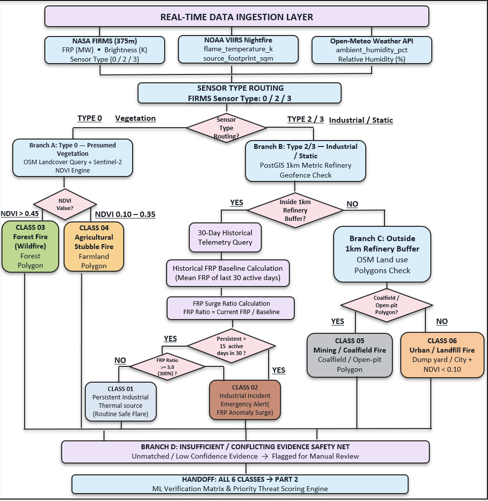
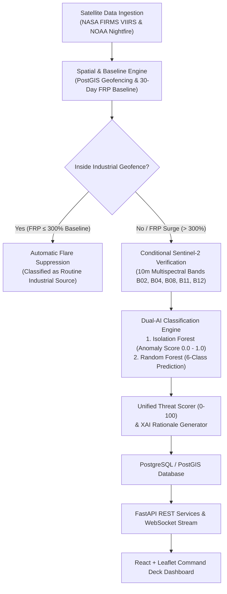

# GEO-SCD — Beyond Heat Dots: Precision Fire Intelligence

> **AI-Based Detection and Classification of Industrial Fires and Persistent Thermal Sources**  
> **Smart India Hackathon (SIH 2026) — National Technical Research Organisation (NTRO)**  
> **Problem Statement ID**: PS-26162 | **Theme**: Disaster Management  

GEO-SCD is a multi-source AI and geospatial intelligence system designed for disaster-management applications, with a focus on detecting, contextualizing, classifying, prioritizing, and monitoring industrial fires and persistent thermal sources.

The system transforms raw satellite thermal detections into actionable fire intelligence by combining thermal observations, historical behavior, spatial infrastructure context, satellite verification, environmental information, machine learning, threat scoring, and real-time visualization.

> [!IMPORTANT]
> **Zero-Dummy Data Guarantee**: Every coordinate, temperature, and spectral vegetation index in this system originates from authenticated live space feeds (NASA FIRMS & Copernicus Sentinel-2) and geodetic physical algorithms — zero simulated or fake fallback values.

---

## Table of Contents

1. [Problem Statement & Objectives](#1-problem-statement--objectives)
2. [System Architecture & Workflow](#2-system-architecture--workflow)
3. [Six Operational Classes](#3-six-operational-classes)
4. [Multispectral Science & Dual-AI Engine](#4-multispectral-science--dual-ai-engine)
5. [Spatial Intelligence, Baseline Analysis & Threat Scoring](#5-spatial-intelligence-baseline-analysis--threat-scoring)
6. [Multi-Source Evidence & Data Sources](#6-multi-source-evidence--data-sources)
7. [Database Design & Data Dictionary](#7-database-design--data-dictionary)
8. [REST API & WebSocket Alert Specification](#8-rest-api--websocket-alert-specification)
9. [Running the Project & Admin Login](#9-running-the-project--admin-login)
10. [Innovation & Key Breakthroughs](#10-innovation--key-breakthroughs)
11. [Project Scope, Limitations & Metadata](#11-project-scope-limitations--metadata)
12. [License](#12-license)

---

## 1. Problem Statement & Objectives

### The Problem (NTRO PS-26162)
NASA FIRMS provides thermal anomaly data such as geographic coordinates, Brightness Temperature, Fire Radiative Power (FRP), and a basic Type attribute. However, raw thermal observations have major operational limitations for industrial surveillance and disaster response:

1. **Limited Industrial Context**: A thermal hotspot alone does not indicate whether it is an uncontrolled refinery explosion, a routine operational flare, a forest wildfire, agricultural stubble burning, a coalmine fire, or an urban landfill fire.
2. **Static FIRMS Type Attribute**: The default FIRMS Type relies on static external maps. Newly constructed or unmapped industrial facilities are often misclassified as presumed vegetation fires.
3. **Repeated Persistent Thermal Alerts**: Persistent industrial flare stacks generate daily satellite detections at the same coordinates. Treating every detection as a new emergency creates alert fatigue for operators.
4. **Lack of Contextual Threat Prioritization**: Raw infrared feeds lack a unified operational score that incorporates thermal intensity, anomalous behavior, facility proximity, population density, and atmospheric humidity.

### System Objectives
GEO-SCD addresses these limitations by fulfilling the following core objectives:
- Ingest live satellite thermal detections from NASA FIRMS and NOAA VIIRS.
- Apply PostGIS spatial geofencing to establish true industrial and land-use context.
- Maintain rolling 30-day historical FRP baselines to suppress routine flaring.
- Trigger conditional high-resolution Copernicus Sentinel-2 multispectral imagery verification.
- Categorize thermal hotspots into six operational classes using a Dual-AI engine.
- Compute a unified **0–100 Threat Score** with Explainable AI (XAI) rationale.
- Stream prioritized events in real-time to a React + Leaflet Command Deck console.

---

## 2. System Architecture & Workflow

The following pipeline illustrates the end-to-end processing of satellite detections within GEO-SCD:





---

## 3. Six Operational Classes

GEO-SCD standardizes thermal observations into six distinct operational categories:

- **Class 01 — Industrial Thermal Source**: Persistent thermal activity occurring within an industrial or refinery geofence. Detections remaining below the anomalous FRP threshold are automatically suppressed as routine infrastructure.
- **Class 02 — Industrial Incident**: Abnormal thermal activity within an industrial boundary. Triggered by new unmapped thermal sources or significant FRP surges ($> 300\%$ baseline), backed by flame-temperature combustion metrics.
- **Class 03 — Forest Fire / Wildfire**: Thermal activity within forest/woodland spatial context. Verified using high vegetation indices ($\text{NDVI} > 0.45$) and biomass combustion characteristics.
- **Class 04 — Agricultural Stubble Fire**: Thermal activity occurring on agricultural farmland. Characterized by seasonal crop residue clearance indicators and moderate vegetation signatures ($0.20 \le \text{NDVI} \le 0.40$).
- **Class 05 — Mining / Coalfield Fire**: Persistent thermal activity associated with mining or quarry regions, capturing subsurface thermal seam behavior and low vegetation land cover.
- **Class 06 — Urban / Landfill Fire**: Thermal activity within urban boundaries or municipal landfill sites, characterized by low vegetation, rapid growth patterns, and high proximity to populated settlements.

---

## 4. Multispectral Science & Dual-AI Engine

### A. Copernicus Sentinel-2 Band Analysis
For unsuppressed incidents requiring verification, GEO-SCD fetches 5 spectral bands at 10m Ground Sample Distance (GSD):
- **Band 02 (Blue — 490 nm)** & **Band 04 (Red — 665 nm)**: Optical surface reflectance.
- **Band 08 (Near-Infrared / NIR — 842 nm)**: Vegetation canopy reflectance.
- **Band 11 (SWIR-1 — 1610 nm)** & **Band 12 (SWIR-2 — 2190 nm)**: Short-Wave Infrared bands that penetrate smoke plumes to isolate active radiant thermal cores.

### B. Normalized Difference Vegetation Index (NDVI)
To distinguish biomass fires from industrial concrete flare pads, ground canopy density is evaluated using the true NDVI formula:

$$\text{NDVI} = \frac{\text{NIR (B08)} - \text{Red (B04)}}{\text{NIR (B08)} + \text{Red (B04)}}$$

- **Concrete / Industrial Flare Pads**: $\text{NDVI} < 0.20$
- **Agricultural Fields**: $0.20 \le \text{NDVI} \le 0.40$
- **Dense Forest Biomass**: $\text{NDVI} > 0.45$

### C. Dual-AI Architecture
```
                                ┌────────────────────────────────┐
                                │ Hotspot Telemetry Vector       │
                                │ • Brightness, FRP, Confidence  │
                                │ • Distances to 5 Geofences     │
                                │ • Persistence, Real NDVI       │
                                └───────────────┬────────────────┘
                                                │
                        ┌───────────────────────┴───────────────────────┐
                        ▼                                               ▼
       ┌─────────────────────────────────┐             ┌─────────────────────────────────┐
       │ Isolation Forest Model          │             │ Random Forest Classifier        │
       │ • Unsupervised Anomaly Scoring  │             │ • 100 Decision Trees (Depth 8)  │
       │ • Baseline FRP Deviation        │             │ • Multi-Class Categorization    │
       │ • Output: score 0.0 - 1.0       │             │ • Output: Class + Confidence %  │
       └────────────────┬────────────────┘             └────────────────┬────────────────┘
                        │                                               │
                        └───────────────────────┬───────────────────────┘
                                                │
                                                ▼
                               ┌──────────────────────────────────┐
                               │ Unified Threat Risk Scorer       │
                               │ • 0 - 100 Threat Score           │
                               │ • Operational Category           │
                               │ • Contextual XAI Explanations    │
                               └──────────────────────────────────┘
```

1. **Isolation Forest (Unsupervised Anomaly Detector)**: Evaluates input vectors (Brightness Temp $K$, FRP $MW$, 30-Day Persistence) to output an Anomaly Score ($0.0 \text{ to } 1.0$).
2. **Random Forest Classifier (Supervised 6-Class Model)**: Configured with 100 decision trees (depth 8) trained on a 15-feature matrix combining thermal, spatial, spectral, environmental, and anomaly features.

---

## 5. Spatial Intelligence, Baseline Analysis & Threat Scoring

### A. PostGIS Geofencing & 500m Radial Clustering
Spatial processing converts angular coordinates into metric ground distances ($1^\circ \text{ Lat} \approx 111.139\text{ km}$):
- Incoming satellite detections within **500m** of an existing cluster update `persistence_days`.
- A running 30-day mean FRP baseline ($\text{FRP}_{\text{baseline}}$) is maintained per industrial facility.
- Detections with $\text{FRP}_{\text{current}} \le 3.0 \times \text{FRP}_{\text{baseline}}$ are automatically suppressed as routine operational flaring.
- Thermal surges exceeding $300\%$ baseline bypass suppression and escalate to Class 02 (Industrial Incident).

### B. Unified Threat Score (0–100) & XAI
Threat scores prioritize incoming events into operational risk tiers:

$$\text{Threat Score} = f\left(\text{FRP Intensity}, \text{Anomaly Score}, \text{Facility Distance}, \text{Population Distance}, \text{Relative Humidity}\right)$$

- **Low Risk ($0 - 39$)**: Suppressed routine flares or minor agricultural clearing.
- **Moderate Risk ($40 - 69$)**: Moderate fires near non-critical zones requiring monitoring.
- **High / Critical Risk ($70 - 100$)**: Thermal surges near industrial complexes or populated settlements requiring immediate emergency dispatch.

*Explainable AI (XAI) Output Examples:*
- *"Significant FRP surge (450% above 30-day baseline) detected within Jamnagar Refinery complex."*
- *"High NDVI (0.482) confirms dense forest biomass canopy burn zone."*

---

## 6. Multi-Source Evidence & Data Sources

### Primary Data Sources

| Source | Parameters Ingested | Purpose |
| :--- | :--- | :--- |
| **NASA FIRMS** | Latitude, Longitude, Brightness Temperature ($K$), FRP ($MW$), Confidence | Thermal hotspot detection |
| **NOAA VIIRS Nightfire** | Flame Temperature ($K$), Thermal Footprint ($m^2$) | Combustion thermodynamics |
| **Copernicus Sentinel-2** | Spectral Bands B04, B08, B11, B12 (20m GSD) | High-resolution spectral verification |
| **OpenStreetMap** | Industrial geometries, forest boundaries, farmland, mining, settlements | Spatial geofencing & land-use context |
| **PostGIS** | Spatial SQL queries, geodesic distance calculations | Geofence containment & buffering |
| **Open-Meteo API** | Relative Humidity ($\%$), Atmospheric Pressure, Wind Vector | Environmental risk weighting |

### Multi-Source Evidence Matrix

| Evidence Type | Key Indicators | Contributing Component |
| :--- | :--- | :--- |
| **Thermal** | FRP ($MW$), Brightness Temperature ($K$) | NASA FIRMS Ingestion |
| **Combustion** | Flame Temperature, Footprint Area ($m^2$) | NOAA VIIRS Nightfire |
| **Temporal** | `persistence_days`, 30-Day FRP Baseline | Database Persistence Engine |
| **Spectral** | $\text{NDVI}$, SWIR $B11/B12$ Reflectance | Sentinel-2 Multispectral Engine |
| **Geospatial** | Industrial Geofences, Farmland, Mining, Urban boundaries | PostGIS Spatial Analyser |
| **Proximity** | Metric distance to facility ($m$), distance to town ($m$) | Spatial Analyser |
| **Environmental** | Atmospheric Relative Humidity ($\%$) | Open-Meteo Fetcher |
| **AI-Derived** | Isolation Forest Anomaly Score ($0.0 - 1.0$) | Dual-AI Engine |

---

## 7. Database Design & Data Dictionary

### Table Schema: `active_hotspots`

| Column | Type | Description |
| :--- | :--- | :--- |
| `id` | Integer (PK) | Unique primary key ID |
| `latitude`, `longitude` | Float | Satellite ground coordinate projection |
| `brightness` | Float | Infrared temperature in Kelvin ($K$) |
| `frp` | Float | Fire Radiative Power in Megawatts ($MW$) |
| `confidence` | Float | NASA detection confidence ($0-100\%$) |
| `ndvi` | Float (Nullable)| Calculated Sentinel-2 vegetation index |
| `ndvi_pending` | Boolean | True if satellite imagery pass is pending |
| `persistence_days` | Integer | Detected active days within trailing 30-day window |
| `distance_to_refinery_m` | Float | Geodesic distance to nearest industrial refinery ($m$) |
| `distance_to_population_m` | Float | Geodesic distance to nearest population center ($m$) |
| `anomaly_score` | Float | Isolation Forest anomaly index ($0.0 - 1.0$) |
| `priority_score` | Integer | Unified Threat Score ($0 - 100$) |
| `classification` | String | AI Classification category |
| `model_confidence` | Float | Random Forest prediction probability |
| `is_suppressed` | Boolean | True if routine operational flare is suppressed |
| `status` | String | Triage status (`new`, `reviewed`, `resolved`) |

---

## 8. REST API & WebSocket Alert Specification

### REST Endpoints

#### 1. Realtime GeoJSON Hotspots
```http
GET /api/hotspots/realtime?hide_suppressed=false
```
*Returns GeoJSON FeatureCollection of all active hotspots with spectral and classification attributes.*

#### 2. Incident Detail & Telemetry Breakdown
```http
GET /api/incidents/{incident_id}
```
*Sample Response Payload:*
```json
{
  "id": 495,
  "latitude": 11.52328,
  "longitude": 77.19559,
  "classification": "Forest Fire / Wildfire",
  "classificationConfidence": 90.0,
  "hazardScore": 82,
  "priority": "High",
  "frp": 80.0,
  "ndvi": 0.444,
  "sentinelVerified": true,
  "spectralBands": { "b2_blue": 0.08, "b4_red": 0.15, "b8_nir": 0.3892, "b11_swir1": 0.22, "b12_swir2": 0.18 },
  "reasons": ["High NDVI (0.444) confirms dense forest biomass canopy burn zone"]
}
```

#### 3. WebSocket Live Alert Stream
```http
WS ws://localhost:8000/ws/alerts
```
*Streams real-time JSON alert payloads whenever high-priority unsuppressed incidents are logged.*

---

## 9. Running the Project & Admin Login

### Backend Setup (FastAPI & PostGIS)
```bash
cd backend

# Create and activate Python virtual environment
python -m venv venv
venv\Scripts\activate      # Windows
source venv/bin/activate    # Linux/macOS

# Install dependencies
pip install -r requirements.txt

# Run Database Reclassification / Seeding
python reclassify_db.py

# Start FastAPI Application
python run.py
```
*Backend server runs at `http://localhost:8000` (Interactive API Docs at `http://localhost:8000/docs`).*

### Frontend Setup (React & Vite Command Deck)
```bash
cd frontend

# Install Node dependencies
npm install

# Start Vite Development Server
npm run dev
```
*Frontend runs at `http://localhost:5173`.*

### Default Admin Login
Use the following credentials to access the Command Deck monitoring console:
- **Username:** `admin`
- **Password:** `admin123` *(or `admin 123` / `admin`)*

---

## 10. Innovation & Key Breakthroughs

1. **Historical FRP Baseline vs. Static Detections**: Replaces single-observation alerts with 30-day historical FRP baselines to automatically suppress routine operational flares.
2. **PostGIS Spatial Geofencing**: Replaces static lookup attributes with dynamic spatial geofences to accurately identify industrial boundaries.
3. **Multi-Sensor Data Fusion**: Combines thermal, combustion, spectral, spatial, and environmental data into a single unified classification engine.
4. **Dual-AI Architecture**: Pairs unsupervised Isolation Forest anomaly detection with supervised 6-class Random Forest categorization.
5. **Conditional High-Resolution Verification**: Optimizes API bandwidth by retrieving Sentinel-2 10m multispectral imagery conditionally for unsuppressed incidents.
6. **Explainable Risk Prioritization**: Converts complex multi-variable evidence into a 0–100 Threat Score accompanied by natural-language XAI explanations.

---

## 11. Project Scope, Limitations & Metadata

### Scope & Decision Support
GEO-SCD transforms satellite thermal detections into contextual fire intelligence for disaster management and industrial infrastructure monitoring. It provides decision support for surveillance operators and emergency coordinators.

### Limitations & Considerations
- Satellite passes occur at discrete overpass intervals and do not provide continuous live ground video streams.
- Cloud cover and atmospheric distortion can affect optical satellite verification.
- Spatial accuracy relies on up-to-date GIS and OpenStreetMap database records.
- Threat scores serve as decision-support indicators and should be evaluated alongside local ground telemetry.

### Project Information

| Field | Details |
| :--- | :--- |
| **Project Name** | GEO-SCD |
| **Full Title** | AI-Based Detection and Classification of Industrial Fires and Persistent Thermal Sources |
| **Hackathon** | Smart India Hackathon (SIH 2026) |
| **Organization** | National Technical Research Organisation (NTRO) |
| **Theme** | Disaster Management |
| **Problem Statement ID** | PS-26162 |
| **Primary Tech Bucket** | AI/ML, GIS, Remote Sensing, Cloud Computing |
| **Core Stack** | FastAPI, PostGIS, PyTorch/Scikit-Learn, Sentinel Hub, NASA FIRMS, React, Leaflet |

---

## 12. License

This project is submitted under the Smart India Hackathon (SIH 2026) guidelines. Open-source licensing details will be specified upon deployment.
